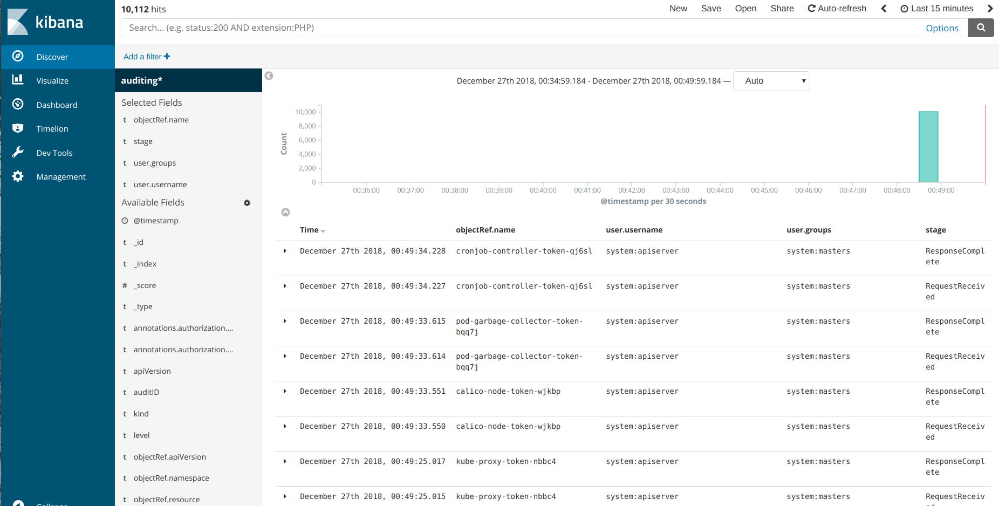
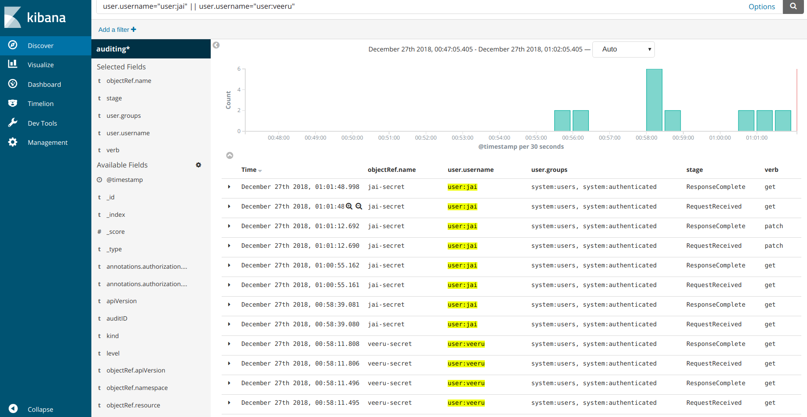

Auditing is an essential administrative input to understand the way a system is affected or being used. An audit trail is a log  of the sequence of chronological events that occurred on a system. It helps administrators understand what event occurred, when did it take place and the trigger or the source of the event.

An simple example of an audit log in the context of kubernetes would be read as

`An nginx pod(podname) was scheduled on a node(nodename) by a serviceaccount(serviceaccountname).`

The above statement helps an administrator or a developer understand the intent of the event (a pod being scheduled), the object in question (the nginx pod), the affecting system, (the node) and, the actor which was the serviceaccount. 

An audit trail would be an effective input to help debug issues, fine tune permissions, understand the way the system is being used and maybe write dynamic webhooks by looking at the audit logs to further tighten what can be done based on the knowledge of these usage patterns. 

Let us look at the way auditing is enabled and dive deeper at the actors in play here. 

Working on kubernetes objects eventually means using the kubernetes REST API, which is either via kubectl or via the kubernetes client libraries. Hence, all the auditing is performed by the kubeapiserver by enabling options for auditing. 

> *Note*: Since the kube-apiserver is the one which generates events, the memory consumption of the apiserver pod increases. This is directly proportional to the number of events generated. 

An audit event is logged when each request is received. A request as it traverses through several stages generates events. A Policy resource defines if these events need to be ignored or to be logged. 

Below are the several stages which generate events as the request traverses through them.
- RequestReceived : The stage when the request is first received before being sent for further processing
- ResponseStarted : This stage is generated for long running requests only. It is triggered when the response headers are sent but the response body is yet to be sent.
- ResponseComplete :  This stage signifies that the response is completed and there is no further processing that will occur on the request.
- Panic :   Generated event when a panic occurs.

Audit policies allows definition of a set of rules which act on the above events and define the level of data that needs to be logged. These are called as audit levels. Below are the audit levels which can be used in an Audit Policy definition. 
- None : Do not log anything. 
- Metadata : Logs only the metadata of the request. Does not log the request or the response body. This is specially useful when you do not want to log request body for a secret or a configmap. 
- Request : Logs metadata and request body but does not log the response. 
- RequestResponse :  Logs metadata, request and response bodies. 

Here is a sample audit policy which we will use in the demonstration below. 
```
apiVersion: audit.k8s.io/v1
kind: Policy
rules:
- level: Request
 resources:
 - group: "" # core
 resources: ["secrets", "configmaps"]
 namespaces: [""]
```
The above Policy logs at the Request level for the secrets and configmap resources. 

Let us enable auditing on the kube-apiserver and write and deploy a sample audit policy. We will also create a couple of users and look at the audit events generated for those users. 


Clone the repo 
```
git clone git@github.com:hr1sh1kesh/repo.git
cd repo/kubernetes-auditing
```


### Create users

Allowing an external user to be authenticated to the kubernetes cluster in order to create / update resources requires performing the following steps. 

Create a request specifying the details of the user which needs access to the cluster.
The users/ folder already has the json files for 2 users, `user:jai` and `user:veeru`.
```
cat << eof >> jai.json
{
    "CN": "user:jai",
    "key": {
        "algo": "ecdsa",
        "size": 256
    },
    "names": [
        {
            "C": "US",
            "L": "CA",
            "ST": "San Francisco",
            "O" : "system:users"
        }
    ]
}
eof
```
Generate the private key and the csr based on the request json. Alternatively, you can also use `cfssl print-defaults csr` and edit the json request file.  

```
cfssl genkey jai.json | cfssljson -bare certificate
```

With the csr and the private key generated, we now need to create a `CertificateSigningRequest` resource which is then approved/rejected by a cluster administrator to allow access to this user on the kubernetes cluster. 

The request is a base64 encoded string of the generated csr. 
```
cat certificate.csr | base64 | tr -d '\n'
```

Copy the above base64 encoded string and use that in the `CertificateSigningRequest`
```
apiVersion: certificates.k8s.io/v1beta1
kind: CertificateSigningRequest
metadata:
  name: user-jai
spec:
  groups:
  - system:authenticated
  request: <REDACTED> # base64 encoded csr
  usages:
  - digital signature
  - key encipherment
  - client auth
```

The new user certificate request needs to be approved, which essentially signs the user generated certificate by the cluster CA. 

> These steps are performed by a cluster administrator

```
kubectl certificate approve user-jai
```

Get the signed certificate for the user. 
```
kubectl get csr user-jai -o jsonpath='{.status.certificate}' | base64 -d > jai.crt
```

Create a kubeconfig entry to be used to interact with the cluster using `kubectl` 
```
kubectl --kubeconfig ~/.kube/config-jai config set-cluster jai --insecure-skip-tls-verify=true --server=<apiserver url:6443>
kubectl --kubeconfig ~/.kube/config-jai config set-credentials jai --client-certificate=jai.crt --client-key=certificate-key.pem --embed-certs=true
kubectl --kubeconfig ~/.kube/config-jai config set-context jai --cluster=jai --user=jai
kubectl --kubeconfig ~/.kube/config-jai config use-context jai
```

These above steps will help prove the authenticity of the user. but the user still does not have any roles assigned to him. 
Create RBAC resources to provide access to the user either across namespaces or within a namespace. 

Provide the user(s) RBAC permissions as suitable on the cluster. 

`kubectl apply -f rbac.yaml`

The user(s) should be able to list pods in the default namespaces now. 
```
kubectl --kubeconfig ~/.kube/config-jai get pods
```

#### Enable auditing. 
The auditing needs to be enabled on the kube-apiserver hence ssh onto the node which runs the kube-apiserver. 

Create a folder which holds the audit policy 
```
mkdir -p /etc/kubernetes/auditpolicies
```
Place the `policy.yaml` spec in the above folder. We will volume mount this in the kube-apiserver pod spec. 

Enable auditing by adding the following options to the kube-apiserver podspec

```
    - --audit-policy-file=/etc/kubernetes/auditpolicies/policy.yaml
    - --audit-log-path=/var/log/audit.log
```

Refer `sample-kube-apiserver.yaml`

The above steps would enable auditing and will log the audit events at a location `/var/log/audit.log`


#### Visualize Audit Logs 

Deploy Elasticsearch and Kibana to ingest and visualize the logs. Fluentd would be used as the log shipper which publishes the audit log to an elasticsearch endpoint. 

`kubectl apply -f es.yaml`
`kubectl apply -f kibana.yaml`

This will deploy an elasticsearch cluster with 3 data pods, 2 master pods and 2 client pods. 
The elasticsearch client service is exposed via NodePort. The clusterIP of this service will be used in the fluentd-config. 

```kubectl get svc elasticsearch```. 

The kibana service is exposed over NodePort. 

Edit the `fluentd` Configmap in the `fluentd.yaml` file. Provide the clusterIP of the elasticsearch client service. 

> *Note*: Fluentd is used as a deployment in this case. It also has a Pod affinity where it gets scheduled to a node which runs the pod with label "component=kube-apiserver"

```
kubectl apply -f fluentd.yaml
```

This will publish the audit log at `/var/log/audit.log` to the elasticsearch cluster, and these logs can be viewed by Kibana



#### Test the setup. 

```
kubectl --kubeconfig ~/.kube/config-jai create secret generic jai-secret --from-literal=username=jai --from-literal=password=topsecret
kubectl --kubeconfig ~/.kube/config-veeru create secret generic veeru-secret --from-literal=username=veeru --from-literal=password=topsecret
kubectl --kubeconfig ~/.kube/config-veeru get secret veeru-secret
kubectl --kubeconfig ~/.kube/config-jai edit secret jai-secret
```

The Audit trail for the above commands should look something like this

